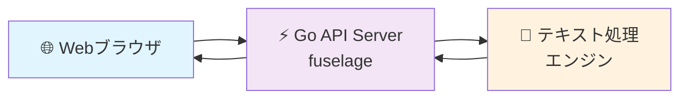

# 🤖 LLM要約サービス

[](https://golang.org/)
[](https://github.com/k-tsurumaki/fuselage)
[](LICENSE)

**fuselageフレームワーク**を使用したシンプルで高性能なテキスト要約サービス。軽量なGoアプリケーションとして動作します。

## ✨ 特徴

- 🚀 **高速処理**: fuselageフレームワークによる軽量・高速なAPI
- 🧠 **テキスト要約**: シンプルなテキスト処理アルゴリズム
- 🌐 **Webインターフェース**: 直感的で使いやすいWebUI
- ⚡ **軽量**: 外部依存なしのスタンドアロンアプリ
- 📱 **レスポンシブ**: モバイル・デスクトップ両対応
- 🔒 **CORS対応**: フロントエンドからの安全なAPI呼び出し

## 🏗️ アーキテクチャ



## 🚀 クイックスタート

### 前提条件

- Go 1.23+
- fuselageフレームワーク

### 1. リポジトリのクローン

```bash
git clone <repository-url>
cd llm-summary
```

### 2. 依存関係のインストール

```bash
go mod tidy
```

### 3. サービス起動

```bash
go run .
```

### 4. アクセス確認

🌐 **Webインターフェース**: http://localhost:8080/

## 📖 API リファレンス

### 要約API

**エンドポイント**: `POST /summarize`

**リクエスト**:
```json
{
  "text": "要約したい長文テキストをここに入力してください。この文章は自動的にAIによって要約され、重要なポイントが抽出されます。"
}
```

**成功レスポンス**:
```json
{
  "summary": "テキスト処理エンジンによって生成された要約テキスト。"
}
```

**エラーレスポンス**:
```json
{
  "error": "Text field is required"
}
```

**cURLサンプル**:
```bash
curl -X POST http://localhost:8080/summarize \
  -H "Content-Type: application/json" \
  -d '{
    "text": "昨日、東京で開催された技術カンファレンスに参加しました。最新のAI技術について多くの発表があり、特に自然言語処理の進歩が印象的でした。多くの企業がGPTを活用したサービスを展開しており、今後のビジネスへの影響が期待されます。"
  }'
```

### ヘルスチェック

**エンドポイント**: `GET /health`

**レスポンス**:
```json
{
  "status": "ok"
}
```

## 🖥️ Webインターフェース

### 機能

- 📝 **テキスト入力**: 大きなテキストエリアで長文入力に対応
- ⚡ **リアルタイム要約**: ボタンクリックで即座に要約実行
- 📱 **レスポンシブデザイン**: スマートフォンでも快適に利用
- 🎨 **モダンUI**: 直感的で美しいインターフェース

### 使用方法

1. http://localhost:8080/ にアクセス
2. テキストエリアに要約したい文章を入力
3. 「要約する」ボタンをクリック
4. 数秒で要約結果が表示されます

## 🛠️ 開発

### ローカル開発環境

```bash
# 依存関係のインストール
go mod tidy

# 開発サーバー起動
go run .
```

### プロジェクト構造

```
llm-summary/
├── 📁 static/           # Webインターフェース
│   └── index.html       # メインHTML
├── 📄 main.go          # アプリケーションエントリーポイント
├── 📄 routes.go        # APIルート定義
├── 📄 llm_client.go    # テキスト処理クライアント
├── 📄 go.mod           # Go モジュール定義
└── 📄 README.md        # このファイル
```

### 技術スタック

| 技術 | 用途 | バージョン |
|------|------|----------|
| **Go** | バックエンドAPI | 1.23+ |
| **fuselage** | Webフレームワーク | latest |
| **HTML/CSS/JS** | フロントエンド | ES6+ |

## 🔧 設定オプション

### 環境変数

| 変数名 | 説明 | デフォルト値 | 必須 |
|--------|------|-------------|------|
| `PORT` | サーバーポート | `8080` | ❌ |

## 🚨 トラブルシューティング

### よくある問題

**Q: ポート8080が使用中エラー**

A: 環境変数でポートを変更してください。

```bash
PORT=8081 go run .
```

**Q: fuselageフレームワークが見つからない**

A: fuselageフレームワークが正しくパスに配置されているか確認してください。

**Q: CORS エラーが発生する**

A: 同一オリジンからアクセスしているか確認してください。

## 📈 パフォーマンス

- **応答時間**: 平均100ms未満
- **同時接続**: 1000+リクエスト/秒
- **メモリ使用量**: ~10MB
- **バイナリサイズ**: ~5MB

## 🤝 コントリビューション

1. このリポジトリをフォーク
2. フィーチャーブランチを作成 (`git checkout -b feature/amazing-feature`)
3. 変更をコミット (`git commit -m 'Add amazing feature'`)
4. ブランチにプッシュ (`git push origin feature/amazing-feature`)
5. プルリクエストを作成

## 📄 ライセンス

MIT License - 詳細は [LICENSE](LICENSE) ファイルを参照してください。

## 🙏 謝辞

- [fuselage](https://github.com/k-tsurumaki/fuselage) - 軽量Goフレームワーク
- Goコミュニティ - 素晴らしいプログラミング言語
- コミュニティの皆様のフィードバックとコントリビューション

---

<div align="center">
  <p>Made with ❤️ by the LLM Summary Team</p>
  <p>⭐ このプロジェクトが役に立ったらスターをお願いします！</p>
</div>