# 🤖 LLM Text Summarization Service

[](https://golang.org/)
[](https://github.com/k-tsurumaki/fuselage)
[](LICENSE)

A high-performance text summarization service powered by **fuselage framework** and **OpenRouter API**. Built as a lightweight Go application with LLM integration.

## ✨ Features

- 🚀 **High Performance**: Lightweight and fast API powered by fuselage framework
- 🧠 **AI-Powered Summarization**: Uses OpenRouter API with Google Gemma model
- 🌐 **RESTful API**: Clean and simple JSON API endpoints
- ⚡ **Lightweight**: Minimal dependencies and fast startup
- 🔒 **CORS Support**: Safe API calls from frontend applications
- 📊 **Health Monitoring**: Built-in health check endpoint
- 🛡️ **Graceful Shutdown**: Proper server lifecycle management

## 🏗️ Architecture

```mermaid
graph LR
    A[🌐 Client] --> B[⚡ Go API Server<br/>fuselage]
    B --> C[🤖 OpenRouter API<br/>Google Gemma]
    C --> B
    B --> A
    
    style A fill:#e1f5fe
    style B fill:#f3e5f5
    style C fill:#fff3e0
```



## 🚀 Quick Start

### Prerequisites

- Go 1.23+
- OpenRouter API key
- fuselage framework

### 1. Clone Repository

```bash
git clone https://github.com/k-tsurumaki/llm-summary.git
cd llm-summary
```

### 2. Install Dependencies

```bash
go mod tidy
```

### 3. Configuration

Set the `LLM_API_KEY` environment variable:

```bash
export LLM_API_KEY="your_openrouter_api_key"
```

Create a `config.ini` file:

```ini
[web]
port = 8080

[llm]
base_url = https://openrouter.ai/api/v1
```

### 4. Start Service

```bash
go run .
```

### 5. Test API

🌐 **Health Check**: http://localhost:8080/health

## 📖 API Reference

### Summarization API

**Endpoint**: `POST /summarize`

**Request**:
```json
{
  "text": "Your long text to be summarized goes here. This text will be automatically processed by AI to extract key points and generate a concise summary."
}
```

**Success Response**:
```json
{
  "summary": "AI-generated summary of the input text."
}
```

**Error Response**:
```json
{
  "error": "Text field is required"
}
```

**cURL Example**:
```bash
curl -X POST http://localhost:8080/summarize \
  -H "Content-Type: application/json" \
  -d '{
    "text": "Yesterday, I attended a technology conference in Tokyo. There were many presentations about the latest AI technologies, and the progress in natural language processing was particularly impressive. Many companies are deploying services that utilize GPT, and the impact on future business is expected."
  }'
```

### Health Check

**Endpoint**: `GET /health`

**Response**:
```json
{
  "status": "ok"
}
```

## 🔧 Configuration

### Environment Variables

| Variable | Description | Default | Required |
|----------|-------------|---------|----------|
| `PORT` | Server port | `8080` | ❌ |
| `LLM_API_KEY` | OpenRouter API key | N/A | ✅ |

### Configuration File

The service uses `config.ini` for configuration:

```ini
[web]
port = 8080

[llm]
base_url = https://openrouter.ai/api/v1
```

**Note**: The `config.ini` file is excluded from version control for security reasons.

## 🛠️ Development

### Local Development

```bash
# Install dependencies
go mod tidy

# Set the LLM_API_KEY environment variable
export LLM_API_KEY="your_openrouter_api_key"

# Start development server
go run .
```

### Project Structure

```
llm-summary/
├── 📄 main.go          # Application entry point
├── 📄 routes.go        # API route definitions
├── 📄 llm_client.go    # OpenRouter API client
├── 📄 config.go        # Configuration management
├── 📄 go.mod           # Go module definition
├── 📄 config.ini       # Configuration file (excluded from git)
└── 📄 README.md        # This file
```

### Tech Stack

| Technology | Purpose | Version |
|------------|---------|----------|
| **Go** | Backend API | 1.23+ |
| **fuselage** | Web framework | latest |
| **OpenRouter** | LLM API service | - |
| **Google Gemma** | AI model | 3-27b-it |
| **INI** | Configuration | - |

## 🚨 Troubleshooting

### Common Issues

**Q: Port 8080 already in use**

A: Change the port in `config.ini` or use environment variable:

```bash
PORT=8081 go run .
```

**Q: fuselage framework not found**

A: Ensure the fuselage framework is properly installed and accessible in your Go path.

**Q: OpenRouter API errors**

A: Check your `LLM_API_KEY` environment variable and ensure you have sufficient credits.

**Q: CORS errors**

A: The service includes CORS headers for cross-origin requests.

## 📈 Performance

- **Response Time**: Depends on OpenRouter API latency
- **Concurrent Requests**: 1000+ requests/second
- **Memory Usage**: ~10MB
- **Binary Size**: ~5MB

## 🤝 Contributing

1. Fork this repository
2. Create a feature branch (`git checkout -b feature/amazing-feature`)
3. Commit your changes (`git commit -m 'Add amazing feature'`)
4. Push to the branch (`git push origin feature/amazing-feature`)
5. Create a Pull Request

## 📄 License

MIT License - see the [LICENSE](LICENSE) file for details.

## 🙏 Acknowledgments

- [fuselage](https://github.com/k-tsurumaki/fuselage) - Lightweight Go web framework
- [OpenRouter](https://openrouter.ai/) - LLM API service
- Go community - Amazing programming language and ecosystem
- Contributors and community feedback

---

<div align="center">
  <p>Made with ❤️ by the LLM Summary Team</p>
  <p>⭐ Star this project if you find it helpful!</p>
</div>
